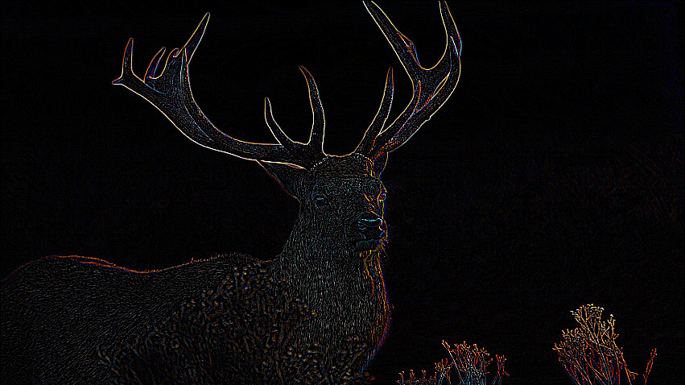

# Kernel Image Processing
> Parallel Computing project using c++ and OpenMP.

## Prerequisites
* gcc 6.3.0

## Brief introduction
This project is about implementing a program of **kernel image processing**. To do it, we need to perform a **convolution** between a **mask** and an **image**.

Based on which mask we use, we can perform **blurring**, **sharping**, **embossing** and more on the image.

The convolution operation is **embarrassingly parallel**, so it well suited to be implemented in **parallel** with **implicit and explicit threading frameworks**.

We show how we can exploit the **hardware parallel mechanisms** of CPUs to add to the concurrency given by threads.

We also show how using a cache friendly data organization in memory, the **Structure of Arrays**, results in better performance.

For more details on the development process of the project and the tools used see the [Final Report](https://github.com/GiovanniBurbi/kernel_image_processing/blob/master/Parallel_Computing_Kernel_Image_Processing.pdf).

                                
            

## Experiments setup
To obtain the results shown in the Final Report has been used a machine with:
* Intel© Core™ i7-8750H CPU @ 2.20GHz with 6 cores / 12 threads
* NVIDIA GeForce GTX 1070 Mobile 8GB
                                         
## Getting started
### Using IDE
* **Clone** this repository in your IDE. **Clion** has been used for this project.
* Set **flags** in the header of "main.cpp" to select the implementation of the algorithm that will be run.
* To **run the C++ application**
   * In your IDE open the file "main.cpp" and run it.
### Using CLI
* Clone this repository.
* Set **flags** in the header of "main.cpp" to select the implementation of the algorithm that will run
* Optionally, you can change the **masktype variable** selecting another kernel enum value. The default is the outline mask
* **Navigate** inside the src folder of the root directory of the project.
* Then enter in the terminal the following commands to **compile** the files:
  * `gcc -c -fopenmp main.cpp kernel/Kernel.cpp image/Image.cpp image/ImageSoA.cpp image/PpmParser.cpp convolution/convolution.cpp`
  * `gcc -fopenmp main.o Kernel.o Image.o ImageSoA.o PpmParser.o convolution.o -lstdc++ -o  main`
* Finally, **run the application**:
  `./main`
